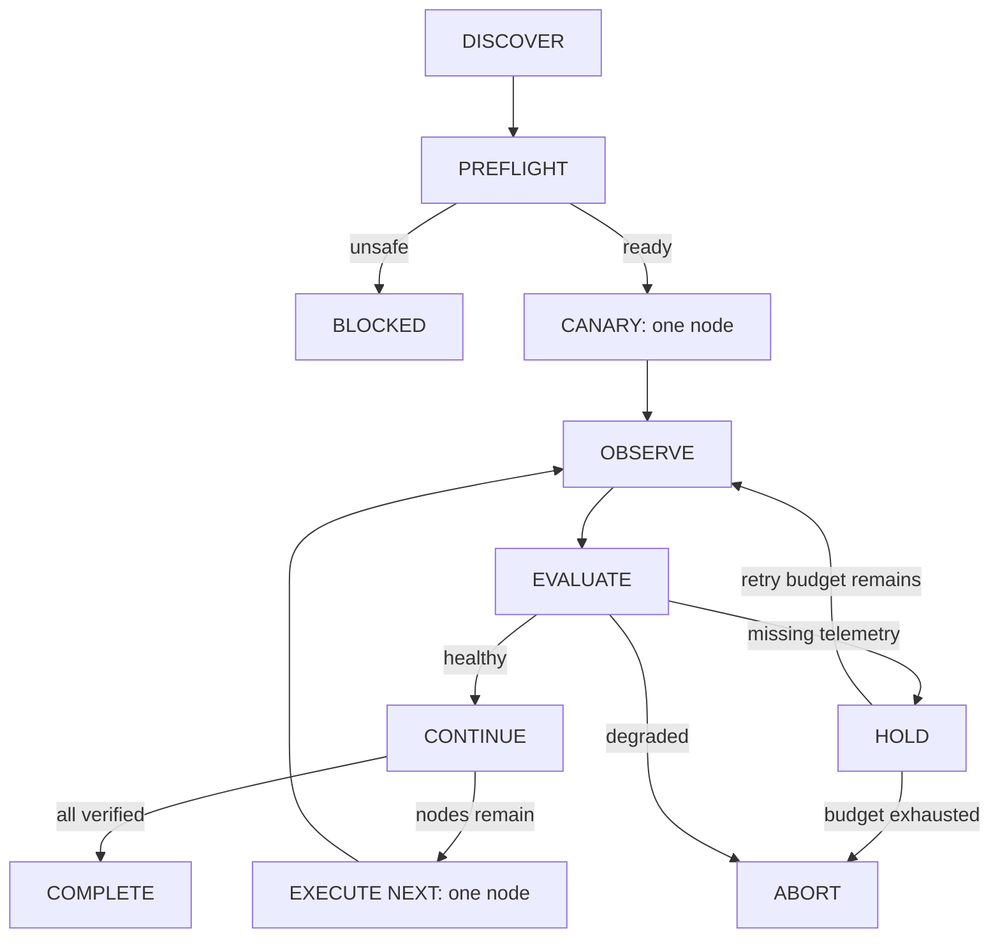

# Maintenance Control Plane — POC

A runnable, dependency-free Python simulator demonstrating **application-aware, health-gated node-image maintenance**. Infrastructure can remain ready while checkout fails; the controller stops further changes when that happens.

This is a local simulation, not an AKS operator. It does not access a cluster or modify cloud resources.

## Interactive browser demo

[Open the GitHub Pages demo](https://gudasriram.github.io/maintenance-control-plane/).

Choose a scenario, run or step through the controller events, inspect fleet progress and health metrics, and download the full scenario report. The browser replays deterministic evidence generated by this same Python controller; it does not run Python or access a live cluster.

For local preview:

```sh
python build_demo.py
python -m http.server 8000 --bind 127.0.0.1 --directory docs
```

Open `http://127.0.0.1:8000`. The Pages workflow tests the controller and regenerates the reports before deploying. Initial repository setup: **Settings → Pages → Source → GitHub Actions**. Subsequent pushes to `main` deploy automatically; the workflow also supports manual runs.

## Quick start

Requires Python 3.11 or newer. No packages or credentials needed.

```sh
python control_plane.py --scenario healthy --output reports/healthy.json
python control_plane.py --scenario checkout --output reports/checkout.json
python -m unittest discover -s tests -v
```

Run these commands from the repository directory. On Windows, `py` can replace `python`.

The healthy run completes 10/10 replacements. The checkout fault aborts after 1/10 even though infrastructure readiness stays green. Exit codes: `0` complete, `2` blocked/aborted or invalid CLI arguments.

## Demonstration scenarios

| Scenario | Expected result | Nodes changed |
| --- | --- | --- |
| `healthy` | COMPLETE | 10/10 |
| `pdb` | BLOCKED: no allowed evictions | 0/10 |
| `capacity` | BLOCKED: insufficient headroom | 0/10 |
| `replicas` | BLOCKED: insufficient replicas | 0/10 |
| `errors` | ABORT: HTTP errors breach gates | 1/10 |
| `latency` | ABORT: P95 exceeds baseline tolerance | 1/10 |
| `checkout` | ABORT: business SLI fails | 1/10 |
| `telemetry` | HOLD, then ABORT after bounded retries | 1/10 |

Use `--nodes N` to change the fleet size (minimum two).

## Control loop



The policy defaults to a maximum 1% error rate, maximum 0.5 percentage-point increase over baseline, maximum 20% P95 latency increase, minimum 99% checkout success and minimum 30% capacity headroom. Each replacement requires three passing simulated observations. Missing telemetry never authorizes a replacement. Changed nodes remain changed after abort; no rollback is claimed.

## Sample checkout application

```sh
python sample_app.py --fault checkout --port 8080
```

Open `http://127.0.0.1:8080/healthz` to see infrastructure readiness and `/checkout` to see the failed business request. `/metrics` exposes the synthetic metric fixture as JSON. Stop with Ctrl+C. Other faults: `healthy`, `errors`, `latency`, `telemetry`.

The controller and HTTP service share the `SampleCheckout` behavior model. The controller consumes it in-process; it does **not** scrape the HTTP service. The fixture metrics illustrate aggregate values, while a faulted checkout endpoint deterministically fails each request. These are synthetic signals, not measured traffic statistics.

## Design and evidence

- `Controller` owns progression, policy evaluation and ordered audit events.
- `Executor` is the boundary for a future infrastructure adapter; only `SimulatedExecutor` is implemented.
- `health_gate` compares readiness, errors, latency and business success with policy and the baseline.
- Reports contain policy, observations, decisions, reasons and final node images.
- The tests verify that blocked runs never execute, degraded runs stop after the canary, missing telemetry holds, executor failures abort and healthy runs verify all nodes.
- GitHub Actions runs tests on Python 3.11–3.13.

## POC boundaries and next steps

Discovery, PDBs, replica placement and capacity are fixtures. The PDB model permits one concurrent disruption and the executor immediately replaces and readies a node. Batches stay at one node. Observations are logical samples with no real soak time. Reports are written at the end; interrupted runs do not resume. There is no multi-controller locking, authentication, live telemetry integration, automatic recovery or production safety guarantee.

Before a real-cluster pilot: add read-only Kubernetes discovery; calculate disruption and placement constraints from live workloads; collect timestamped telemetry over real windows; implement a durable reconcile loop with idempotent execution and leases; then add an explicitly approved executor and operation-specific recovery. A real adapter must revalidate safety before every change and handle partial/unknown execution outcomes.
